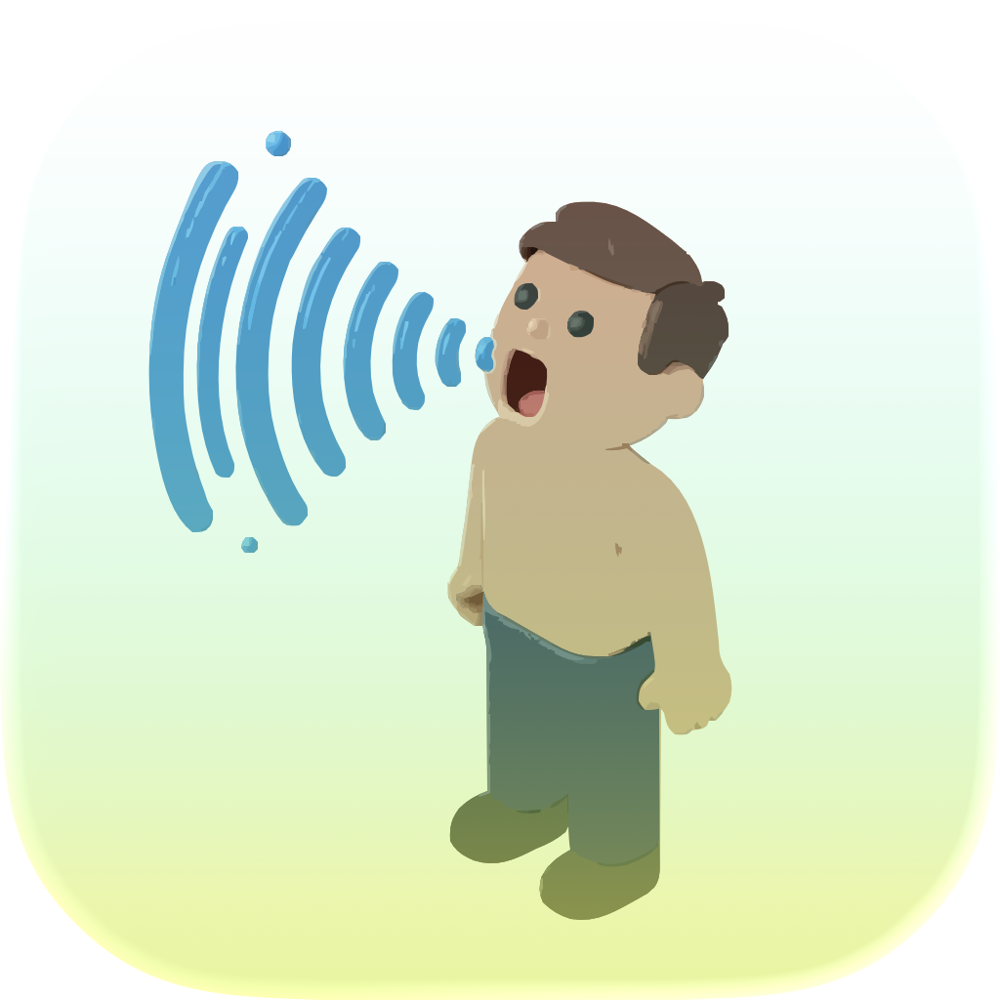

  <h1>Mów</h1>
  

   
   

  <strong>
    Free and open source Voice-to-text app for MacOS
  </strong>
 
   
   
  

    
  

   
  
   
   

Mów (pronounce `/ˈmuf/`) is an open-source voice-to-text app for macOS that offers fast, accurate dictation across all your apps with intelligent context awareness. Unlike Apple Dictation or cloud-based alternatives, Mów processes everything on-device using open-source AI models, ensuring complete privacy with no data leaving your machine and no subscription costs.

## 🔖 Features

### Core Features
- **Complete Privacy**: All processing happens on-device—no data leaves your machine, ever
- **Open Source**: Fully transparent—audit the code, verify privacy claims, contribute improvements
- **No Subscriptions**: All AI processing is free—no API keys, no ongoing costs
- **Customizable AI Post-Processing**: Control how your speech is processed with customizable system prompts
- **Model Transparency**: Open models on HuggingFace with clear metadata about performance
- **Status Visibility**: Clear visual feedback (purple/green/yellow/red indicator) shows app status at a glance

### Advanced Features (Coming Soon)
- **Context Awareness**: Intelligent processing that adapts based on the active application
- **Learning System**: Improves accuracy over time by learning from your corrections and adapting to your accent
- **Custom Vocabulary**: Add domain-specific terminology (medical, technical, names, etc.)
- **Mode System**: Predefined modes (Email, Code, Notes) with different formatting and processing rules
- **Custom Modes**: Create your own modes for specific workflows
- **Document Context**: Use surrounding text for better accuracy
- **Automation Support**: AppleScript, URL schemes, and integration with automation tools

## How it works ❓

- **Native Swift application** using [FluidAudio](https://github.com/FluidInference/FluidAudio) for speech-to-text and [LLM.Swift](https://github.com/eastriverlee/LLM.swift) for text cleaning
- **CoreML** for on-device inference, leveraging Apple Neural Engine (ANE) on M1/M2/M3 Macs
- **Unified architecture**: Single Swift codebase (no IPC complexity)
- Models are downloaded from HuggingFace and cached locally in `~/Library/Caches/`

When the application starts up, it loads the needed models in memory, so they can be used immediately. The dot color in the menu bar logo indicates the application status: purple (app requires user to enable permissions), green (everything is loaded and app is ready to use), yellow (model loading or being downloaded), red (a problem happened, see logs).

Audio is processed, optionnaly cleaned out (remove hesitation, filler words, hesitation markers, or speech disfluencies) by a SLM before being sent back to the user.

**Processing Pipeline**: audio recorded → processed by speech-to-text model (FluidAudio/CoreML) → processed by text-to-text SLM (CoreML) → written text

The application only lives in the menu bar and doesn't have a Dock icon.

## 🚀 Quickstart

### Prerequisites

**To run Mów** (downloaded app or built from source):

- **macOS** 14 (Sonoma) or later
- At least 1GB of free storage (models downloaded from [HuggingFace](https://huggingface.co/models))
- **Microphone access** — you can enable it from the app, required to record your voice
- **Accessibility permission** — you can enable it from the app, required for injecting typed text into other apps

You can download the latest DMG from the [Releases](https://github.com/krokoko/mow/releases) page.

### Building from source

To build the application from source and setup your environment, please refer to the [developer guide](./docs/guides/DEVELOPER_GUIDE.md).

## How to use it ❓

For the full tutorial and troubleshooting, please refer to the [user guide](./docs/guides/USER_GUIDE.md).

## Uninstall

Mów can be uninstalled by quitting the app and moving it to the trash. Make sure you clean any generated logs and cache with model artifacts. The location of these files is indicated in the settings window.

## 🗺️ Roadmap

### Phase 1: Core (Current)
- ✅ On-device processing with FluidAudio/CoreML
- ✅ Customizable AI post-processing (system prompt)
- ✅ Model selection and transparency
- ✅ Status indicators
- ✅ Reliable text injection

### Phase 2: Advanced Features (Planned)
- 🔄 Custom vocabulary and basic learning
- 🔄 Mode system (Email, Code, Notes, Custom)
- 🔄 Enhanced learning from corrections
- 🔄 Document context awareness
- 🔄 Automation support (AppleScript, URL schemes)

### Phase 3: Community & Ecosystem (Future)
- 📋 Model marketplace and community contributions
- 📋 Workflow templates and sharing
- 📋 Plugin system for extensions

## 🆚 Why Mów?

**vs. Apple Dictation**: Complete privacy (on-device vs. cloud), customizable AI processing, context awareness, and open source transparency.

**vs. Cloud-Based Apps**: No subscription costs, no API keys needed, works completely offline, and your data never leaves your device.

**vs. Other On-Device Apps**: Open source, better organized settings, active community development, and full transparency about models and processing.

Mów follows a "Transparent & Empowering" philosophy, giving you control and customization without hiding complexity or sacrificing privacy.

## Dependencies

To see all dependencies used by Mów and their licenses, please refer to the dedicated [documentation](./docs/THIRD_PARTY_LICENSES.md).

## 🙌 Contributing

Please refer to the [contributing guide](./CONTRIBUTING.md)