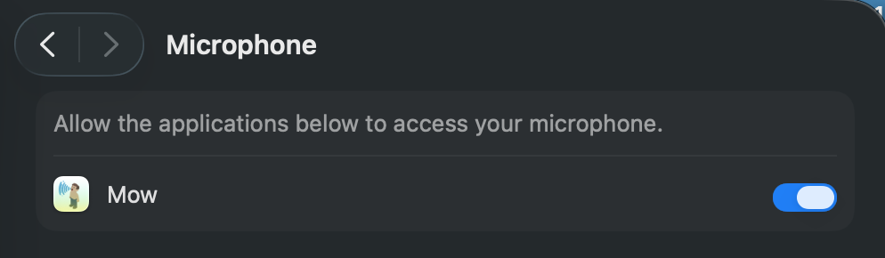
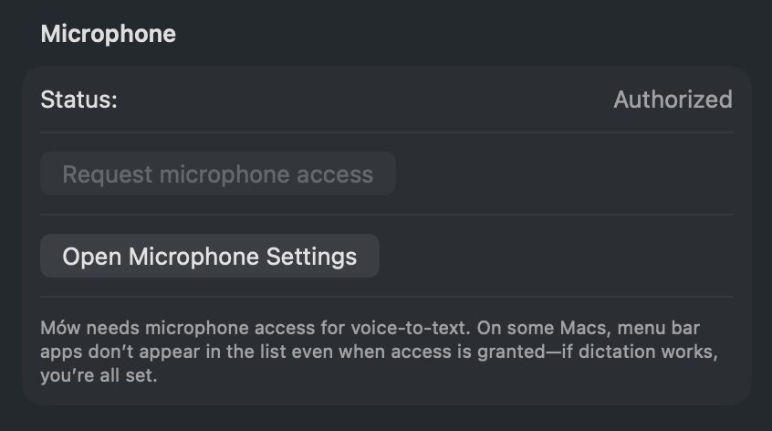
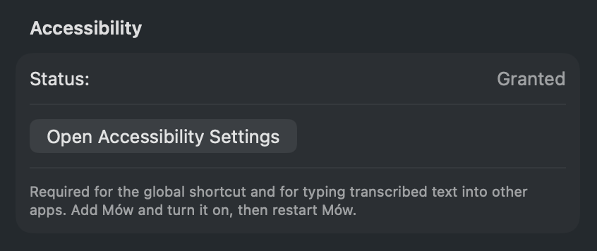

# Mów — User guide

This guide explains how to use Mów for voice-to-text dictation on your Mac.

## What is Mów?

Mów (pronounced like “moo”) is a **menu-bar-only** voice-to-text app for macOS. It runs entirely **on your Mac**—no cloud, no subscriptions, no data sent elsewhere. You press a keyboard shortcut, speak, and the transcribed (and optionally cleaned) text is inserted where your cursor is.

- **Menu bar only** — No Dock icon; everything is controlled from the **Mów icon in the top menu bar**.
- **Press-and-hold to record** — Default shortcut is **⌥ Option + M**: hold to record, release to stop. The text is then processed and inserted.
- **Privacy** — Speech and text are processed on-device using local AI models.

---

## First-time setup

### 1. Install

- Download the latest **Mow.app** (or DMG) from [Releases](https://github.com/krokoko/mow/releases).
- Drag **Mow.app** into **Applications** (recommended).

### 2. Permissions

Mów needs two macOS permissions. The app **does not request them automatically**, you grant them from **Settings** (menu bar → Settings).

| Permission | Why |
|------------|-----|
| **Microphone** | To record your voice for speech-to-text. |
| **Accessibility** | To type the transcribed text into the active app (e.g. Notes, Mail, browser). |

The menu bar dot is **purple** until both are granted. Then it turns yellow (loading models) and finally green (ready).

Microphone permissions settings:



**Microphone**

- In **Settings → Microphone**, click **Request microphone access**. When the system dialog appears, click **Allow**.
- If the system never shows the dialog, see [Troubleshooting](#microphone-permission-dialog-never-appears) below.

Microphone permissions granted:



**Accessibility**

- In **Settings → Accessibility**, click **Open Accessibility Settings**. Add **Mów** and turn it **on**, then **restart Mów** (menu bar → Quit Mów, then open the app again).

Without Accessibility, the shortcut may not work in other apps and text won’t be inserted.

Accessibility permissions granted:



### 3. Models (first run)

- After both permissions are granted, the icon turns **yellow** while Mów **downloads and loads** speech and text-cleaning models (from HuggingFace). This can take a few minutes and needs about **1 GB** of free space. For subsequent runs, the models will be cached.
- When the icon turns **green**, the app is ready to use.

---

## How to use dictation

1. **Open any app** where you can type (Notes, Mail, Slack, browser, etc.) and put the **cursor** where you want text to appear.
2. **Press and hold** the dictation shortcut (default: **⌥ Option + M**). The microphone icon will appear in the menu bar.
3. **Speak** while holding the key.
4. **Release** the key when you finish (maintain the option key pressed). Mów will:
   - Stop recording
   - Run speech-to-text
   - Optionally clean the text (remove fillers like “um”, “uh”)
   - Insert the result at the cursor (or paste via clipboard if injection isn’t available)

You don’t click the menu bar to start recording—only the **keyboard shortcut** triggers recording.

**Recording length:** There is no fixed maximum; you can hold the shortcut as long as you like. For best accuracy and faster processing, keep each segment to **under about 30–60 seconds**. For longer dictation, release the key periodically and start again.

---

## Menu bar icon

The **dot** next to the Mów menu bar icon shows status:

| Color | Meaning |
|-------|--------|
| **Purple** | Permissions needed. Grant **Microphone** and **Accessibility** in **Settings** (menu bar → Settings). |
| **Yellow** | Loading. Models are downloading or loading; wait until it turns green. |
| **Green** | Ready. Both permissions granted and models loaded; you can dictate. |
| **Red** | Error. Something went wrong; open **View Logs** from the menu for details. |

---

## Settings (menu bar → Settings)

Open the **Mów** menu in the menu bar and choose **Settings**.

### Microphone

- **Status** — Shows whether microphone access is **Authorized**, **Denied**, or **Not Determined**.
- **Request microphone access** — Opens a window and asks the system to show the Allow/Don’t Allow dialog. Click **Allow** when it appears.
- **Open Microphone Settings** — Opens **System Settings → Privacy & Security → Microphone**.

### General

- **Launch at login** — Start Mów automatically when you log in. Works when the app is in the **Applications** folder.

### Accessibility

- **Status** — Shows whether Accessibility is **Granted** or **Not granted**.
- **Open Accessibility Settings** — Opens **System Settings → Privacy & Security → Accessibility** so you can add Mów and turn it on. Restart Mów after enabling.

### Keyboard Shortcut

- **Shortcut** — Set the key used with **Option** (e.g. ⌥ M). The trigger is **Option + that key**: hold to record, release **that key** to stop.
- **Restart shortcut** — If the shortcut stops working in other apps, click this (or ensure Mów is enabled in **System Settings → Privacy & Security → Accessibility**).

### Text cleaning

- **Enable text cleaning** — When on, a small language model removes filler words and disfluencies (e.g. “um”, “uh”) from the raw transcription. When off, you get the raw speech-to-text output.
- **SLM system prompt** — Customize how the cleaner behaves. Takes effect after you **restart the app**. Use **Reset to default** to restore the built-in prompt.

### Logs

- **Open Logs Window** — Shows the last transcriptions and errors. Useful when the icon is **red** or something didn’t work as expected.

---

## Model Management (menu bar → Model Management)

- **Speech-to-Text** — Shows FluidAudio ASR status and **cache location** (models are stored under `~/Library/Caches/`).
- **Text cleaning (SLM)** — Shows SLM cache, current model, and options to **Download / Reload SLM** or **Clear SLM cache** if you need to free space or fix a bad download.

---

## Uninstalling

1. **Quit Mów** (menu bar → **Quit Mów**, or ⌘Q).
2. Move **Mow.app** to the Trash.
3. (Optional) Remove data:
   - **Logs:** `~/Library/Application Support/Mow/logs/`
   - **Cache (models):** `~/Library/Caches/Mow/` (and any FluidAudio cache under `~/Library/Caches/`)

---

## Troubleshooting

### Microphone permission dialog never appears

- Some Macs don’t show the system “Allow” dialog for menu bar apps. Try:
  1. **Quit Mów** completely (menu bar → Quit Mów).
  2. Open **Terminal** and run:
     ```bash
     tccutil reset Microphone com.daedalus-labs.mow
     ```
  3. Open **Mów** again and go to **Settings → Request microphone access**. The system dialog should appear; click **Allow**.
- If Mów still doesn’t appear under **System Settings → Privacy & Security → Microphone**, but dictation works when you use the shortcut, you’re fine—the app has access.

### App shows “Denied” but System Settings has Microphone (or Accessibility) on

- macOS ties permissions to the **exact app** (path and build). If you installed a **new version** (e.g. a new DMG) or run the app from a different location, the system may still show the *old* build as allowed while the one you’re running has no permission.
- **Fix:** Quit Mów, then run `mise run reset-permissions` (or the `tccutil reset` commands in Terminal). Open Mów again; when the system prompts, click **Allow** for Microphone, and enable Mów in **System Settings → Privacy & Security → Accessibility** if needed.

### Microphone stays denied and can't be added to the list

- After reset, if **Microphone** still shows as denied and the app **doesn't appear** in **System Settings → Privacy & Security → Microphone** (or you can't turn it on), try in order:

  **A. Reset with Terminal having Full Disk Access**  
  1. **Quit Mów**.  
  2. **System Settings → Privacy & Security → Full Disk Access** → add **Terminal**, turn it **on**.  
  3. Open a **new** Terminal window, go to the project folder, run: `mise run reset-permissions`.  
  4. **Launch Mów** and click **Allow** when the system dialog appears.

  **B. If reset still fails (e.g. "Operation not permitted" or "Failed to reset")**  
  On some macOS versions Apple blocks `tccutil reset` for Microphone. The only reliable workaround is to **reinstall the app** so the system treats it as new and shows the prompt again:

  1. **Quit Mów** (menu bar → Quit Mów).  
  2. **Move Mow.app to Trash** (e.g. from Applications) and **empty Trash**.  
  3. **Install again** (drag from the DMG or run your build).  
  4. **Open Mów**; when the system "Allow / Don't Allow" dialog appears, click **Allow** for microphone.

  After that, the app should have microphone access. If dictation works, you're set.

### Shortcut doesn’t work in other apps / text isn’t inserted

- **Accessibility** is required for the shortcut to work globally and for text to be typed into other apps.
  1. Open **System Settings → Privacy & Security → Accessibility**.
  2. Enable **Mów**.
  3. If Mów isn’t listed, add it with the **+** button. Choose **Mow.app** from **Applications** (if you installed from the DMG). If you’re **running from Xcode**, you must add the built app instead—see [Developer guide](development/DEVELOPER_GUIDE.md) (“Running from Xcode: enabling Accessibility”) for the path (Xcode’s DerivedData → Build/Products/Debug or Release → Mow.app).
  4. **Restart Mów** (Quit, then open again).
- In **Settings → Keyboard Shortcut**, click **Restart shortcut**.
- If it still fails, quit other apps that might be using the same shortcut or conflicting with input monitoring.

### Menu bar icon stays yellow (loading) for a long time

- First run downloads models; this can take several minutes and needs a good internet connection and about 1 GB free space.
- Check **Model Management** for errors (e.g. “Not loaded”, download failures). You can try **Download / Reload SLM** or **Clear SLM cache** and try again.
- Ensure **System Settings → Privacy & Security → Microphone** (and optionally **Accessibility**) are allowed so the app can run normally.

### Menu bar icon is red (error)

- Open **View Logs** from the menu (or **Settings → Open Logs Window**) and read the last lines for the error message.
- Common causes: missing or corrupted models, permission denied, or a one-off failure. Restarting the app or re-downloading models (Model Management) often fixes it.
- Log file location: **~/Library/Application Support/Mow/logs/mow.log** (you can open this in a text editor if the in-app Logs window isn’t enough).

### Dictation is slow or inaccurate

- **Slow:** First transcription after launch can be slower while models are used; later ones are faster. On Apple Silicon (M1/M2/M3), CoreML uses the Neural Engine for better speed.
- **Inaccurate:** Try speaking clearly and reducing background noise. You can turn **off** text cleaning in Settings to see the raw transcription and adjust the **SLM system prompt** if you want different cleaning behavior.

### “Launch at login” doesn’t work

- This works when **Mow.app** is in the **Applications** folder (or possibly in a subfolder of Applications). If the app is on the Desktop or elsewhere, the option may not take effect.

### App doesn’t appear in the menu bar

- Ensure you opened **Mow.app** (double-click from Applications or Spotlight). The app has no Dock icon by design; only the menu bar icon is shown.
- On first launch, the icon may appear after a short delay once the app has finished starting.

---

## See also

- [README](../../README.md) — Features, roadmap, and how it works.
- [Releases](https://github.com/krokoko/mow/releases) — Download the latest version.
